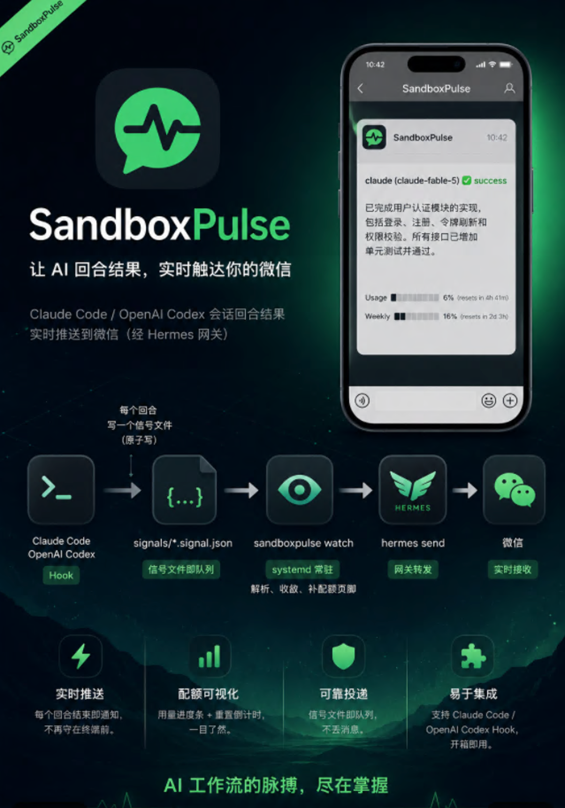

# SandboxPulse



把 Claude Code / OpenAI Codex 会话的回合结果实时推送到微信(经 Hermes
网关):agent 跑完一个回合,手机上就能看到它说了什么、配额还剩多少,
不用守在终端前。

> [!IMPORTANT]
> **收到 SandboxPulse 提示后,尽量在微信里回复 `ok`。** 微信 iLink
> 的主动推送受回复窗口和 `context_token` 额度限制;你的每次入站回复
> 都会刷新可用 token,并触发 SandboxPulse 立即冲刷积压通知。`ok`
> 只是推荐的最短回复,发送任意消息也可以。若额度耗尽,通知不会丢失,
> 而是留在本地队列,等下次回复 `ok` 后继续发送。

```
Claude Code / Codex hook
        │  每个回合写一个信号文件(原子写)
        ▼
signals/*.signal.json        ← 信号文件本身就是投递队列
        ▼
sandboxpulse watch           ← systemd 常驻;解析、收敛、补配额页脚
        ▼
hermes send → 微信
```

通知长这样:

```
claude (claude-fable-5) ✅ success

<agent 的最后一条回复>

Usage █░░░░░░░░░ 6% (resets in 4h 41m) | Weekly ██░░░░░░░░ 16% (resets in 2d 3h)
```

## 依赖

SandboxPulse 不包含微信传输层。部署前需要先准备以下组件:

| 依赖 | 作用 | 要求 |
|------|------|------|
| Linux + systemd | 常驻运行 watcher 和 Hermes 网关 | 需要支持 `systemctl --user` |
| Python | 运行 SandboxPulse | 3.11 或更高 |
| [uv](https://docs.astral.sh/uv/) | 安装 Python 依赖和运行命令 | 必需 |
| [Hermes Agent](https://github.com/NousResearch/hermes-agent) | 连接微信 iLink 并提供 `hermes send` | **必须单独安装、扫码配对并常驻运行** |
| Claude Code / OpenAI Codex CLI | 产生 hook 事件 | 至少安装一个 |

当前部署方式面向 Linux/systemd。macOS 或容器环境需要自行替换常驻服务
管理方式。

## 部署到新机器

四个互相独立的部分,按顺序装:Hermes Agent(微信传输层)→ 本仓库
(watcher + hook 脚本)→ Claude Code / Codex 全局 hook → systemd
用户服务。

### 0. 前置条件

- Linux,systemd 用户单元可用(`systemctl --user`)
- Python ≥ 3.11 和 [uv](https://docs.astral.sh/uv/)
- Claude Code 和/或 Codex CLI 本身
- `git`、`curl`

### 1. 安装 Hermes,配对微信并启动网关

按 [Hermes 官方安装文档](https://hermes-agent.nousresearch.com/docs/getting-started/installation/)
安装。Linux/macOS 可使用官方安装脚本:

```bash
curl -fsSL https://raw.githubusercontent.com/NousResearch/hermes-agent/main/scripts/install.sh | bash
hermes --version
```

然后配置微信。运行交互式向导并选择 Weixin,按终端提示扫码:

```bash
hermes gateway setup
hermes gateway install
hermes gateway start
hermes gateway status --deep
```

iLink 配对绑定机器、无法迁移,新机器必须重新扫码。配对后先在微信里
给机器人发送 `ok`,再列出可用目标:

```bash
hermes send --list weixin
hermes send --to 'weixin:<openid>@im.wechat' 'deploy test'
```

把 `hermes send --list weixin` 输出的完整 target 用在后续配置中。
微信收到 `deploy test`,传输层才算就绪。失败时注意
`hermes send --quiet` 的 stderr 可能为空,具体原因看
`~/.hermes/logs/errors.log`。

Hermes 网关必须保持运行,否则无法记录你的 `ok` 回复,SandboxPulse
也就不能利用入站消息刷新额度和立即冲刷积压队列。更多微信配置说明见
[Hermes Weixin 文档](https://hermes-agent.nousresearch.com/docs/user-guide/messaging/weixin/)。

### 2. 克隆仓库,配置 .env

```bash
git clone https://github.com/wanghy0804/SandboxPuls.git ~/Git/SandboxPuls
cd ~/Git/SandboxPuls
uv sync
cp .env.example .env
```

`.env` 至少填送达目标:

```bash
SANDBOXPULSE_HERMES_TARGET=weixin:<openid>@im.wechat
```

全部变量见[下方表格](#命令与环境变量)。不配目标时 `watch` 是纯日志
模式:信号照样消费即删,但不发任何微信——部署时漏了这步,后面验证
会表现成"链路通了但收不到"。

### 3. 安装 hooks

```bash
./scripts/install-hooks.sh --global
```

写入 `~/.claude/settings.json` 和 `~/.codex/config.toml`,幂等(检测
到 `sp_signal.py` 字样即跳过)。给两个 provider 各注册五类事件
(SessionStart / UserPromptSubmit / PreToolUse / PostToolUse / Stop),
每条 hook 超时 3 秒。

hook 脚本与信号目录的路径按**脚本所在位置**推导,所以要从希望 hook
指向的那份仓库副本里运行。不带 `--global` 是项目级安装,只对本仓库
目录里的会话生效。

### 4. systemd 用户服务

watcher 必须比终端会话活得久(无人监管的 `watch` 会随终端一起退出,
通知就静默断了),所以跑成 systemd 用户单元。写
`~/.config/systemd/user/sandboxpulse-watch.service`(`%h` 是 systemd
的家目录占位符;仓库不在 `~/Git/SandboxPuls` 时改成实际路径):

```ini
[Unit]
Description=SandboxPulse signal watcher - forwards terminal signals to WeChat via Hermes

[Service]
# .env 按工作目录解析,必须指向仓库,否则读不到 Hermes 目标
WorkingDirectory=%h/Git/SandboxPuls
# HermesEmitter 按 PATH 查找 `hermes`。开了 linger 后本单元在开机时启动,
# 早于任何登录会话,开机默认 PATH 里没有 ~/.local/bin —— 这行必须保留,
# 且必须包含 hermes 与 uv 实际所在的目录。
Environment=PATH=%h/.local/bin:/usr/local/sbin:/usr/local/bin:/usr/sbin:/usr/bin:/sbin:/bin
# 仅当机器无法直连 api.anthropic.com 时才需要;没有它们通知照发,
# 只是 Usage 页脚静默消失:
#Environment=http_proxy=http://127.0.0.1:7897
#Environment=https_proxy=http://127.0.0.1:7897
ExecStart=%h/.local/bin/uv run sandboxpulse watch --signal-dir %h/Git/SandboxPuls/signals
Restart=always
RestartSec=5

[Install]
WantedBy=default.target
```

`--signal-dir` 必须和第 3 步结尾打印的 `signals will land in: …`
一致,否则 hook 写的文件没人消费。

```bash
systemctl --user daemon-reload
systemctl --user enable --now sandboxpulse-watch   # 立即启动 + 开机自启
loginctl enable-linger "$USER"                     # 一次性:不登录也随开机启动
```

### 5. 端到端验证

注入一条合成的终态信号,约 20 秒内微信应收到消息:

```bash
SIG_DIR=~/Git/SandboxPuls/signals    # unit 里 --signal-dir 的值
printf '{"agent_id":"deploy-test","state":"success","timestamp":"%s","seq":1,"result":"new machine deploy OK","error_detail":null,"metadata":{"event":"Stop","tool":"","provider":"claude"}}' \
  "$(date -u +%Y-%m-%dT%H:%M:%S.%6N+00:00)" > "$SIG_DIR/deploy-test-1-a.signal.json"
journalctl --user -u sandboxpulse-watch -n 20    # 出现 ERROR 行 = 发送失败
```

发射器成功时不打日志——信号文件消失且没有 ERROR 行,就是已交付微信。
若报 `iLink rate limited`,在微信里回复机器人 `ok`,watcher 检测到
入站消息后会跳过当前退避并立即重试(见[微信额度与立即取件](#微信额度与立即取件))。

最后开一个真实的 claude / codex 会话跑一个回合,确认 hook → 微信的
全链路。

### 6. 日常运维

```bash
systemctl --user status sandboxpulse-watch
systemctl --user restart sandboxpulse-watch   # 更新代码后
journalctl --user -u sandboxpulse-watch -f
```

这是**用户**单元——普通 `systemctl status` 找不到它。重启/停机不丢
通知:停止时对队列里每条做最后一次发送尝试,没送出去的信号文件留在
磁盘,下次启动按时间序回放。

### 命令与环境变量

- `sandboxpulse watch --signal-dir DIR [--hermes-target T]` — 常驻
  消费信号文件,终态通知经 `hermes send` 推到 IM;没配目标时纯日志
  模式
- `sandboxpulse version`

| 变量 | 默认 | 作用 |
|------|------|------|
| `SANDBOXPULSE_HERMES_TARGET` | — | `hermes send` 目标,如 `weixin:<openid>@im.wechat` |
| `SANDBOXPULSE_HERMES_MIN_INTERVAL_S` | `10` | 排队消息之间的发送间隔(秒) |
| `SANDBOXPULSE_HERMES_DEBOUNCE_S` | `0` | 回合结束后的静默期(秒),0 关闭 |
| `SANDBOXPULSE_HERMES_PULL_LOG` | `~/.hermes/logs/gateway.log` | 回复 `ok` 后立即取件所监听的网关日志,置空禁用 |
| `SANDBOXPULSE_LOG_LEVEL` | `INFO` | watcher 日志级别 |

hook 侧的变量由 install-hooks.sh 直接写进 hook 命令行:`SP_PROVIDER`
(claude/codex)、`SP_SIGNAL_DIR`(信号目录)、`SP_DEBUG_DIR`(可选,
转储原始 hook payload 供排查)。

## 业务逻辑与原理

### 分工:三个组件,各管一段

1. **hook**(`scripts/hooks/sp_signal.py`)— 挂在 Claude Code / Codex
   的 hook 事件上,每个事件落一个信号文件就退出。无状态、永不阻塞
   agent:任何失败都 exit 0,超时 3 秒。终态事件会顺手从会话
   transcript 尾部抠出 agent 的最后一条回复(截 1500 字符)、模型名
   和用量。
2. **watch**(`sandboxpulse watch`)— 唯一的常驻进程。盯信号目录,
   解析文件,决定哪些值得发、发什么、什么时候发,经 `hermes send`
   投递。
3. **Hermes** — 微信传输层(iLink 机器人),只负责把一条文本送进
   微信。

hook 和 watch 之间唯一的契约是信号文件;watch 和微信之间唯一的契约
是 hermes CLI。任何一段挂了,另两段不受影响,文件队列把中间状态兜住。

### 状态机:终态和「等你输入」值得打扰你

hook 把每个事件映射成状态(全集:`idle / generating / tool_calling /
executing / waiting_approval / success / error / timeout`):

| hook 事件 | 状态 |
|-----------|------|
| SessionStart | idle |
| UserPromptSubmit / PreCompact | generating |
| PreToolUse | tool_calling |
| PreToolUse(提问类工具:AskUserQuestion / ExitPlanMode / request_user_input) | **waiting_approval(暂停)** |
| PostToolUse | executing |
| PermissionRequest | **waiting_approval(暂停)** |
| Notification(permission_prompt / idle_prompt / elicitation_dialog 或无类型) | **waiting_approval(暂停)** |
| Notification(auth 等非暂停类) | generating |
| Stop / SessionEnd / SubagentStop | **success(终态)** |

终态(success / error / timeout)和暂停态(waiting_approval)会变成
微信通知——暂停态带上 agent 正在等什么(问题选项 / 待批命令 / 计划
内容)。其余中间状态唯一的用途是**取消**:它说明会话还活着,排队中
尚未发出的旧「已结束 / 等输入」通知已经过时,直接作废。

暂停通知守三条规则,保证不淹没结果通知:

- **一次暂停只提醒一次**:送达后,同一会话再来的暂停信号(比如 60s
  idle 重复提醒)一律静默,直到该会话出现新活动重新武装;
- **结果永远优先**:暂停通知不会顶掉/延后排队中的结果通知,结果到来
  则直接取代排队中的暂停;
- **答完即作废**:用户在终端把问题答了(新活动到来),还没发出的暂停
  通知直接取消。

### 信号文件即队列(核心设计)

没有数据库、没有 broker——`ls signals/` 就是待发队列的真实视图:

- **原子写**:hook 先写 `*.signal.json.tmp` 再 rename,watcher 永远
  读不到半个文件。(hook 写崩留下的 tmp,超过 1 小时由 `watch` 启动
  时清扫。)
- **落盘即承诺,送达才删除**。文件只有三种消亡方式:通知已送达、被
  同会话更新的终态覆盖、被同会话新活动取消。其余情况一律留在磁盘上。
- **at-least-once**:`watch` 启动先按 mtime 回放积压——watcher 没在
  跑的窗口(重启、崩溃、停机)产生的信号照样送达。极端崩溃时机宁可
  重发一条,绝不丢。
- 文件名 `{provider}-{会话哈希}-{seq}-{随机}.signal.json`,seq 取微秒
  时间戳,同会话可排序。

### 排队与收敛规则

发送队列在内存里按会话收敛,信号文件是它的持久化影子:

- **立即发送**:回合一结束马上发,不等待;`MIN_INTERVAL_S`(默认
  10 秒)只用来隔开多条排队消息。
- **覆盖**:同一会话排队期间来了更新的终态,旧的作废,只发最新一条。
- **取消**:同一会话有了新活动(下一回合开始),还没发出去的旧通知
  作废。
- **乱序保护**:积压回放偶发乱序时,比已排队的更旧的信号直接丢弃,
  绝不让旧消息盖掉新消息。
- **优先级**:claude 的消息排在 codex 之前出队。
- **可选静默期**:`DEBOUNCE_S`(默认 0=关闭)开启后,回合结束先等
  N 秒,期间该会话有新活动就取消——省额度但有延迟。

### 失败重试与迟到标记(第一原则:终态通知必须送达)

任何发送失败——非零退出(含限频)、60 秒超时、乃至 `hermes` 二进制
暂时找不到(开机早期 PATH 不全)——都只是「还没送到」,按指数退避
**无限重试**:5 → 15 → 15 → … 分钟,封顶 15 分钟。重试等待期间同
会话来了更新的终态,直接换发新的。

超过 10 分钟才送达的消息加「⏰ 迟到 Xm」前缀而不是丢弃;迟到时长按
文件落盘时间计算,跨重启依然准确。

### 微信额度与立即取件

iLink 机器人 API 只在收到用户消息时铸造新的 context_token,主动推送
只有在 token 有效期内才可靠——你刚给机器人发完消息的那一刻,就是
发送成功率最高的时机。`watch` 据此 tail Hermes 网关日志
(`HERMES_PULL_LOG`):一看到微信 inbound,立即把整个积压队列冲刷
出去(跳过静默期和重试退避,claude 优先,10 秒间隔,60 秒冲刷窗口)。

**推荐操作习惯:每次收到 SandboxPulse 通知后都回复 `ok`。** 这会持续
刷新微信侧的接收窗口和 context_token 额度。`ok` 不是协议关键字,
任意入站消息都能触发刷新;统一回复 `ok` 只是最简单、最容易记住。

额度耗尽或通知静默太久时,给机器人回复 `ok`,积压消息会立即开始重试。
微信侧额度和有效期可能调整;本项目只能检测失败、保留队列并等待新的
入站消息,无法绕过 iLink 的限制。

### Usage 页脚

- **claude**:transcript 里没有配额数字。`watch` 用
  `~/.claude/.credentials.json` 里的 OAuth token 调 Anthropic 的
  usage 端点,拿 5 小时窗 / 7 天窗的 used-percent(就是 Claude Code
  里 `/usage` 显示的那两个数),结果缓存 60 秒。需要能访问
  `api.anthropic.com`(直连,或在 unit 里配代理)。
- **codex**:rollout 文件自带 rate-limit 百分比,hook 直接转发,
  不需要网络。

拿不到就静默省略页脚,绝不影响通知本身。

### 注意事项

- **绝不要在同一个信号目录上同时跑两个 `watch`**——每条通知会送达
  两次。
- **iLink 回复窗口**:主动推送依赖最近一次微信入站消息。收到通知后
  尽量立即回复 `ok`;报 `iLink rate limited` 时也先回复 `ok`,再等
  watcher 自动重试。
- **context_token 额度**:当前实测连续主动发送约 5~6 条后可能受限,
  具体额度由微信侧决定。耗尽后通知自动排队,回复 `ok` 会刷新 token
  并立即冲刷积压。
- **报错要去 errors.log 找**:`hermes send --quiet` 失败时 stderr
  为空,具体原因看 `~/.hermes/logs/errors.log`。
- **systemd 的 PATH**:linger 开机启动时默认 PATH 没有
  `~/.local/bin`,unit 里那行 `Environment=PATH=…` 删掉后每次发送都
  会 "hermes binary not found"。送达保证会兜住(无限重试),但通知
  会一直迟到,直到 PATH 配对。
- **代理与 Usage 页脚**:机器无法直连 api.anthropic.com 又没在 unit
  里配代理时,通知照发但 Usage 页脚**静默消失**——shell profile 里
  的代理变量,systemd 用户服务拿不到。
- **hook 永不报错**:hook 任何失败都静默 exit 0(绝不能拖死 agent
  会话),所以「信号根本没写出来」不会有任何报错。排查用
  `SP_DEBUG_DIR` 转储原始 payload。
- **送达速度**:微信每条约 15-20 秒;多条排队按 10 秒间隔依次出队,
  期望「秒达」是不现实的。
- **特殊文件系统**(本机历史包袱,新机器在正常本地磁盘上可忽略):
  开发仓库挂在可能掉线的 mount 上时,全局 hook 应指向本地磁盘的运行
  时副本,改动 `scripts/` 后用 `./scripts/sync-hook-runtime.sh` 推送
  (镜像 `scripts/` → `$HOME/Git/SandboxPuls/scripts/`,可用
  `SP_RUNTIME_DIR` 改目标);uv 无法在仓库内管理 `.venv` 时,给命令
  加前缀 `UV_PROJECT_ENVIRONMENT=/tmp/sandboxpulse-venv
  UV_LINK_MODE=copy`;Mypy cache 也无法落盘时再加
  `MYPY_CACHE_DIR=/tmp/sandboxpulse-mypy-cache`。运行 watcher 所需的
  uv 变量要同时加进 systemd unit。

## 隐私与安全

- SandboxPulse 会从 Claude Code / Codex 的本地 transcript 中读取
  agent 最后一条回复,最多截取 1500 字符后经 Hermes 发往微信。不要
  在通知目标不可信时使用本项目。
- Claude Usage 页脚会读取 `~/.claude/.credentials.json` 中的 OAuth
  token,只用于请求 Anthropic usage 端点;拿不到配额时会静默跳过。
- `.env`、`signals/`、本地 AI 工具配置和 GitNexus 索引已加入
  `.gitignore`。提交前仍应执行 `git status` 检查是否误入敏感文件。
- Hermes 与微信 iLink 的账号、数据和限频规则不由本项目控制。部署前
  请自行评估对应服务条款和数据合规要求。

## 开发与贡献

```bash
uv run --extra dev pytest
uv run --extra dev ruff check src tests
uv run --extra dev mypy src/sandboxpulse
```

欢迎通过 Issue 报告问题或提交 Pull Request。涉及通知投递、重试或
信号文件生命周期的改动,请同时补充对应测试。

## License

[MIT](./LICENSE)
